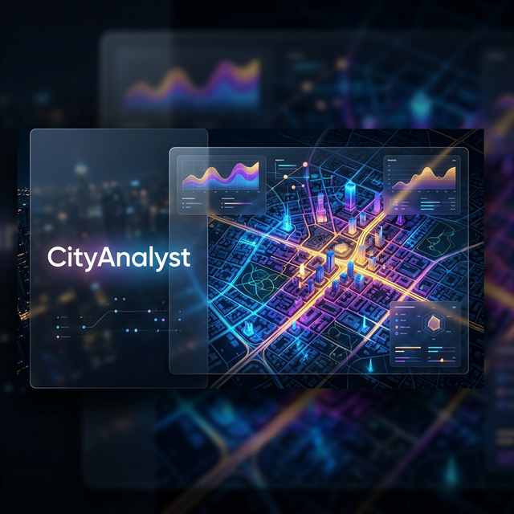
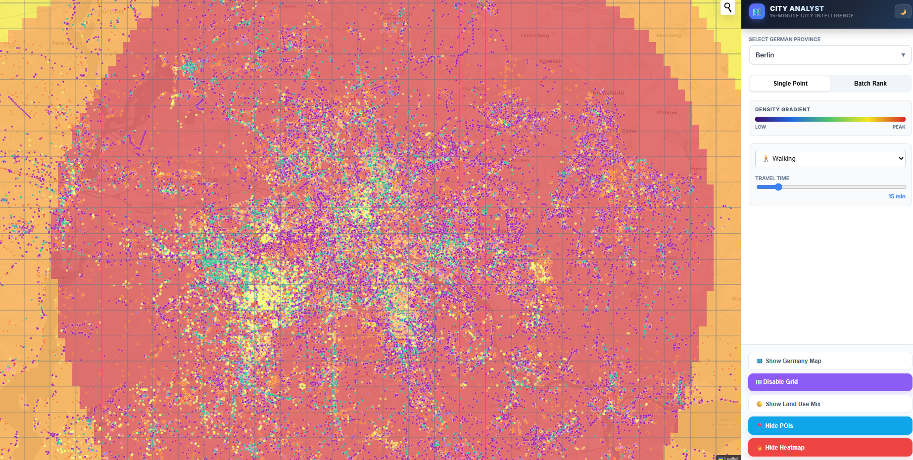
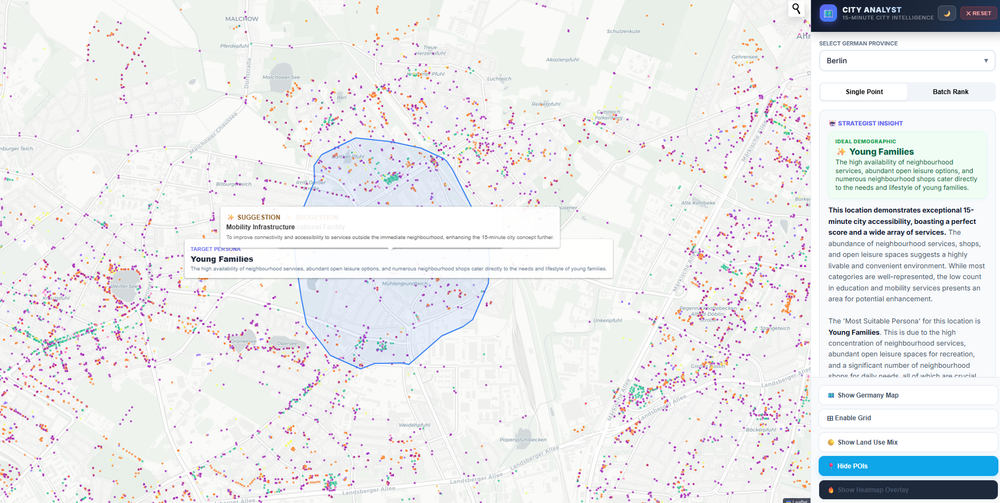

  

# 🏛️ CityAnalyst: The Ultimate Urban Intelligence Platform

**CityAnalyst** is a premium, high-performance urban planning application designed to decode the complexity of the **15-Minute City**. It transforms raw geospatial data into actionable intelligence, providing a surgical view of urban accessibility, service density, and neighborhood potential.

  

---

## 💎 Premium Feature Suite

CityAnalyst is engineered with attention to every "small" detail that makes a professional GIS tool powerful.

### 🇩🇪 German-Scale Geospatial Integration
- **Full Germany Coverage**: Pre-loaded datasets for all German provinces.
- **Dynamic Boundary Loading**: High-precision Germany state boundaries that load seamlessly upon selection.
- **Auto-Province Detection**: Reverse-geocoding automatically identifies the local province to pull the correct spatial indices.

### 🗺️ Advanced Map Overlays

  
  

- **Heatmap (KDE) Overlay**: Visualize the "Urban Heartbeat" with Kernel Density Estimation peaks.
- **Land Use Mix Entropy**: Specialized color gradients visualizing the diversity of urban fabric.
- **Interactive POI Management**: Toggle thousands of Point-of-Interest (POI) markers on/off with zero performance hit using Canvas rendering.

  
  

### ⏱️ Pro Mobility & Isochrone Analysis

- **Dynamic Isochrones**: 15-minute walking/cycling accessibility polygons.
- **Adjustable Parameters**: 
    - **Travel Time Range**: Change the analysis from 5 to 30 minutes on the fly.
    - **Mobility Modes**: Switch between walking and other strategic transit options.
    - **Batch Radius Control**: Fine-tune the search radius for batch-style location scouting.

### 📊 Precision Scoring & Custom Weights
- **Real-Time 15-Min Score**: A 0-100 score driven by Density, Quantity, and Diversity.
- **Manual Weight Input**: Complete control over category importance. Input specific weights for Healthcare, Education, etc.
- **Weight Visibility**: A dedicated "Weight Inspector" to see exactly how your custom priorities are influencing the final score.

### 🤖 AI Review & Strategic Suggestions
- **Automated Property Review**: AI-generated reports describing the "Vibe" and suitability of an area.
- **Strategic Improvement Suggestions**: Concrete, data-backed recommendations on where to place the next park or clinic.
- **Persona-Based Analysis**: Deep-dive into which demographic (Students, Seniors, Families) the area serves best.

### 📋 Batch-Wise Site Comparison

- **Multi-Location Ranking**: Input multiple coordinates to receive a relative performance leaderboard.
- **Investment Rationale**: AI-driven "Why" behind the top-ranked location.

---

## 🛠️ Technical Architecture

| Layer | Technology |
|---|---|
| **Core UI** | React 18, Vite, Tailwind CSS / Glassmorphism |
| **Mapping Engine** | Leaflet, React-Leaflet |
| **Spatial Math** | @turf/turf, Geoblaze |
| **Data Source** | OpenStreetMap (Overpass API), GeoTIFF Rasters |
| **Intelligence** | Google Gemini 2.0 Flash-Lite |
| **Charting** | Recharts (Radar/Spider charts) |

---

## 📖 Deep Technical Documentation

CityAnalyst is more than a map; it's a methodology. Explore our guides:

- [**Full Features Catalog**](docs/features.md): Every button, slider, and toggle explained.
- [**The Scoring Methodology**](docs/methodology.md): How we calculate the 40-30-30 accessibility score.
- [**Technical Deep-Dive**](docs/architecture.md): Data flow from OSM to your screen.

---

## 📄 License & Legal

This project is licensed under the MIT License - see the [LICENSE](LICENSE) file for details.
Designed and Developed by **Sanojan**.
